:::note[Before Reading]
如果是想要看關於 Google 實習的任何事情，這篇心得文章「完全沒有」  
因此，請不要期待會在這篇文章中看到任何關於實習、工作的內容 

關於去日本的遊記，請參考其他篇文章（還沒有寫） 
關於在 Google 實習的心得，請參考其他篇文章（還沒有寫）
:::

:::warning
這篇文章出現的照片都是公共區域，原因很簡單也沒有辦法  
因為我們不能拍攝任何訪客不能進入的辦公區域。因此不用期待看到太多特殊的照片
:::

### 前言

首先，老實說我到現在還是覺得彷彿在作夢一樣  
沒想到幾個實習生隨便口嗨講講就真的去日本了

我可以很老實地說我有點後悔去程的機票時間，讓我沒有機會吃到 Shibuya Google Office 的午餐。  
看了其他實習生的照片跟他們的評價，真的挺後悔的（希望可以把吃到當作我的下一個人生目標吧 XD）

### 對涉谷辦公室的第一印象

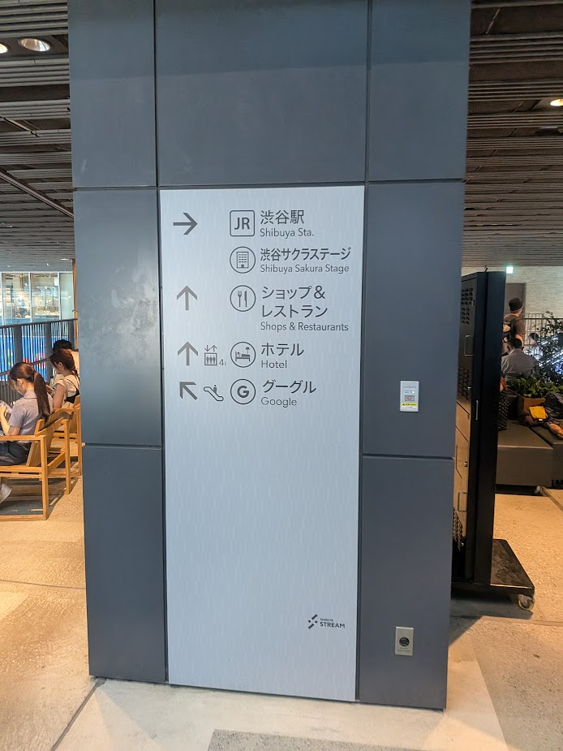

大廳就在涉谷車站一出來的某一個商場樓上  
令我意外的是我沒有想到他直接從車站出來是這麼的動線完美  
（因為 101 的辦公室真的上去太麻煩了 = =）

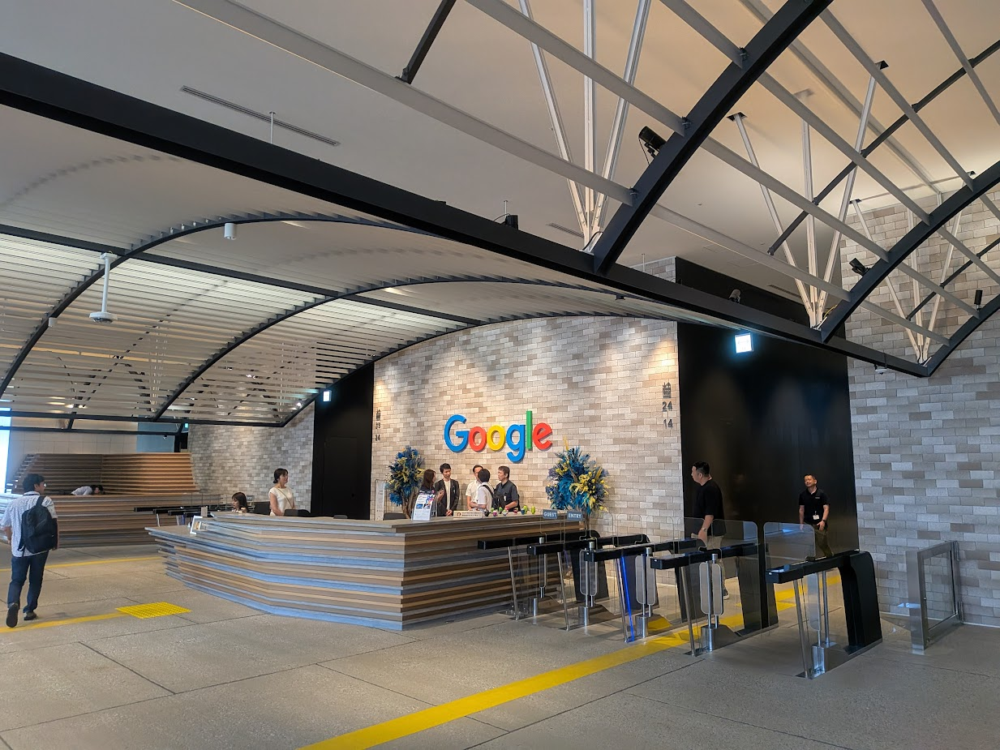

大廳的設計非常明亮乾淨，我覺得整體設計比台灣的幾個辦公室漂亮很多

有一個小插曲是我去涉谷的時候因為已經下午兩三點了，所以所有的行李置物櫃都滿了  
於是我只好拖著行李進去辦公室。  
（直到我拿著我自己的 badge 刷進去前全部的 security 都在看我） 
（我猜是因為每天都太多的遊客走錯路了）

### 公共設施

#### 咖啡廳

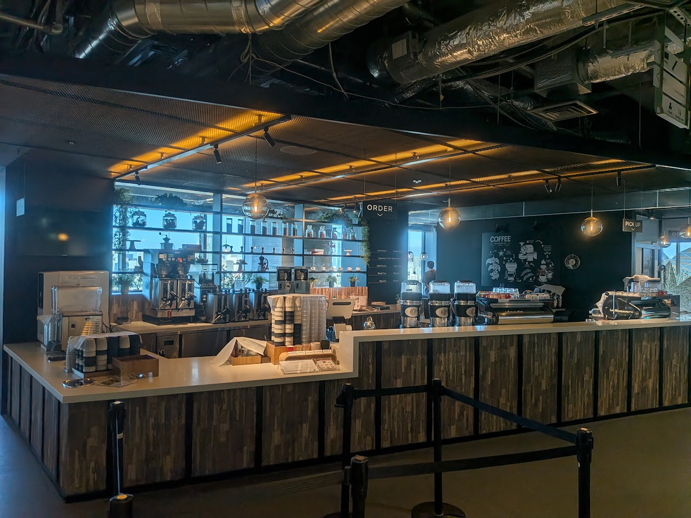

我覺得涉谷的咖啡廳比板橋的厲害很多  
不只是有更多無咖啡因的選項給我這種不喝咖啡的小孩  
店員還會很客氣地問我名字以及有沒有特殊需求  
簡直就是真的外面的高級咖啡廳的樣子（板橋你也很棒但 ...）

#### 公共座位

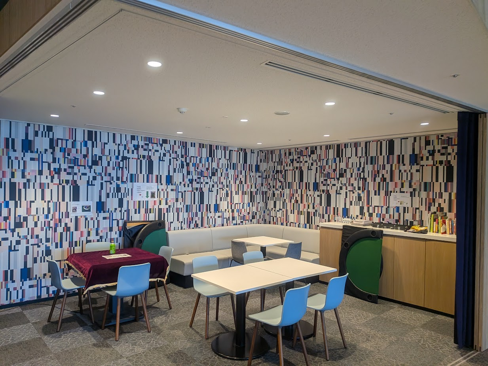

這邊的公共座位有非常多不同的風格，上面的是一般的沙發椅的座位  
下面可以看到還有塌塌米跟各種類型的座位。我覺得這樣其實蠻好的

（也許員工的心情會變好然後工作效率會 up up）

私心希望台灣的各個辦公室也可以有更多類型的椅子

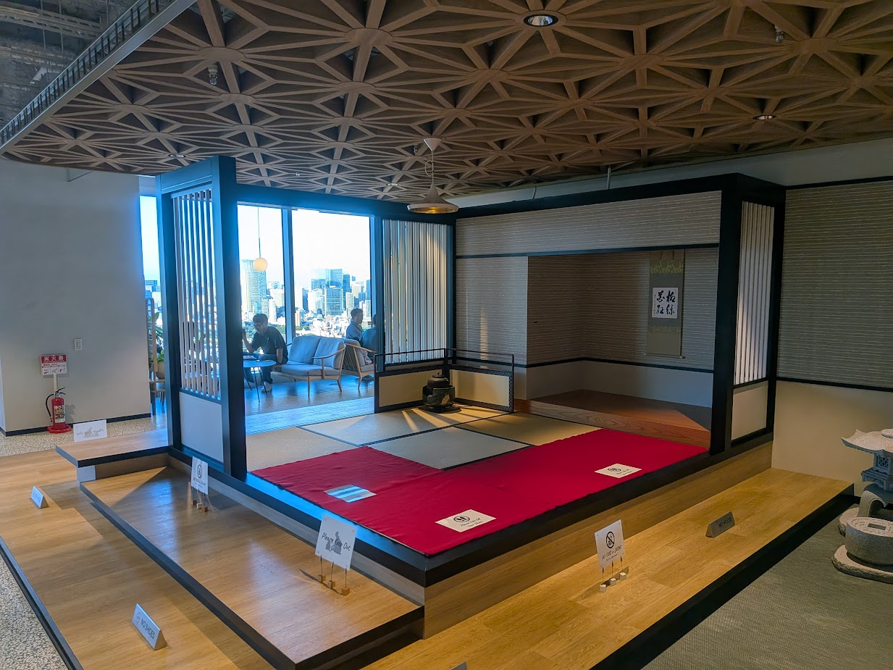
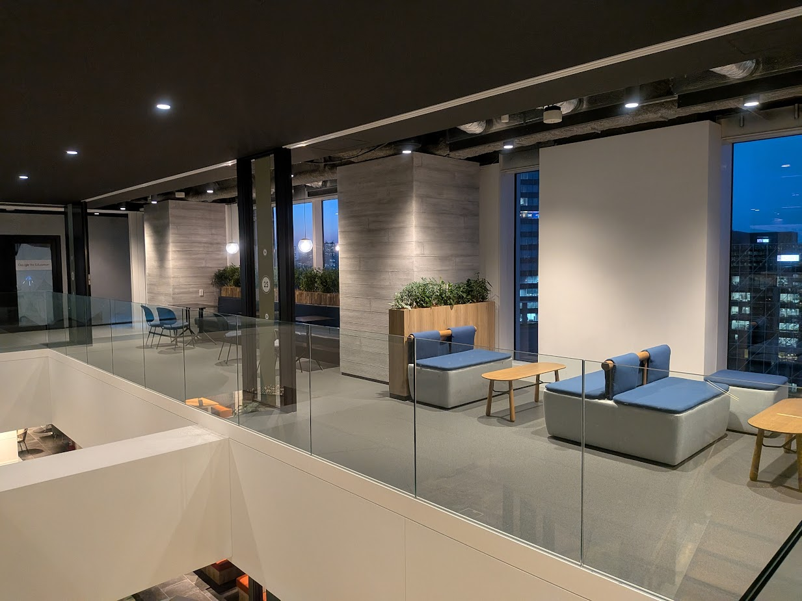

#### 各種牆壁彩繪跟內裝

我覺得有一點很酷（板橋也有但板橋的在 restricted area 所以不能拍）  
就是這邊有蠻多有特色的彩繪牆壁，例如有很多日本著名景點的繪畫牆。

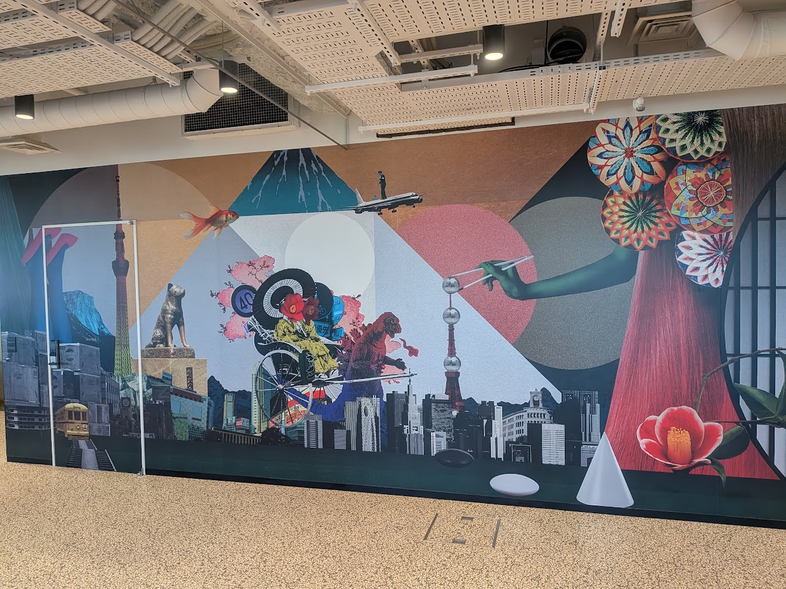
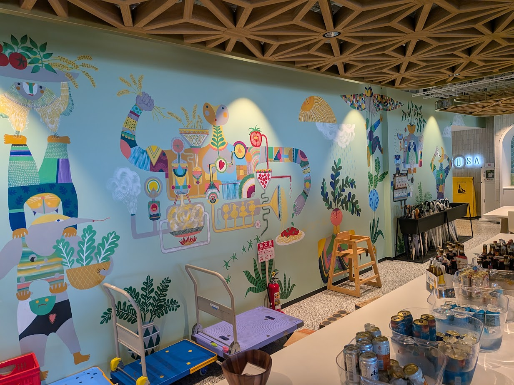

### 下午茶

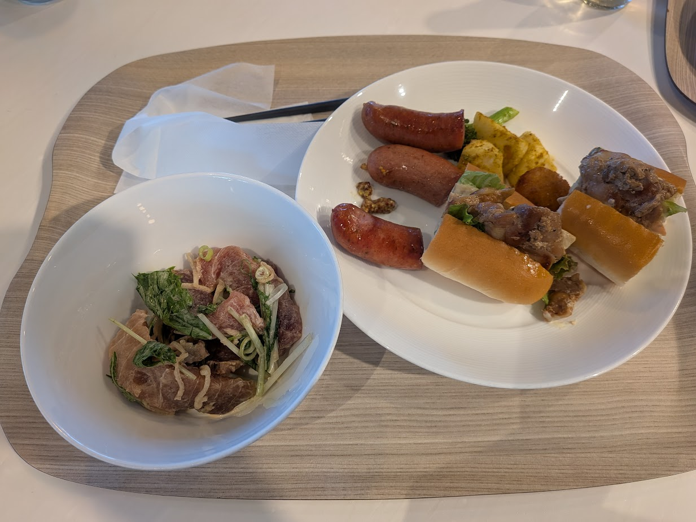

這邊的下午茶非常的好吃，尤其是有好多種類型的生魚和各種熟食。  
我蠻喜歡他的生鮪魚跟雞肉三明治的。

再次感到殘念的是我沒有吃到午餐 QQ

這邊有一個很酷的地方是會有由 FTE 組成的各個樂團跟表演團隊輪流上去演奏音樂  
有機會回去台灣要參加看看台灣的 TGIF 才對。

### 其他

我覺得涉谷辦公室有好多的安卓公仔好可愛啊  
尤其是拿著棉花糖跟 OREO 餅乾 >w<

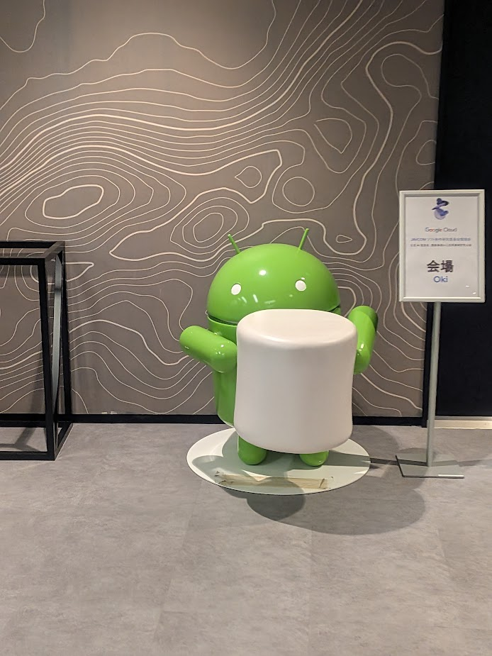
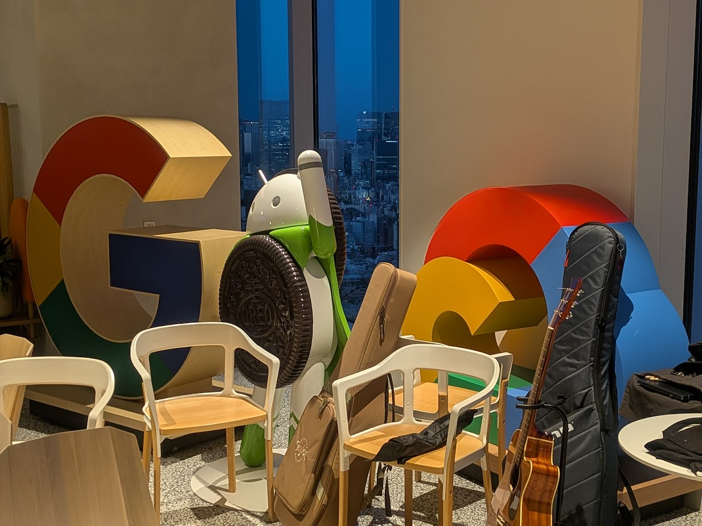

還有就是涉谷辦公室完全的可以取代 Shibuya Sky 了吧  
尤其是完全不用排隊就隨便你在牆壁旁邊拍照  
對於我這種超討厭人擠人的人來說真的是天堂

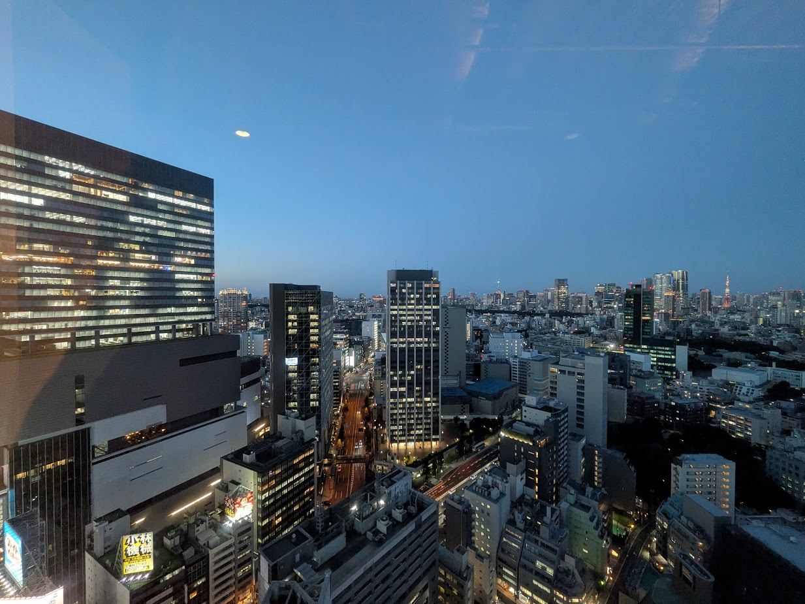
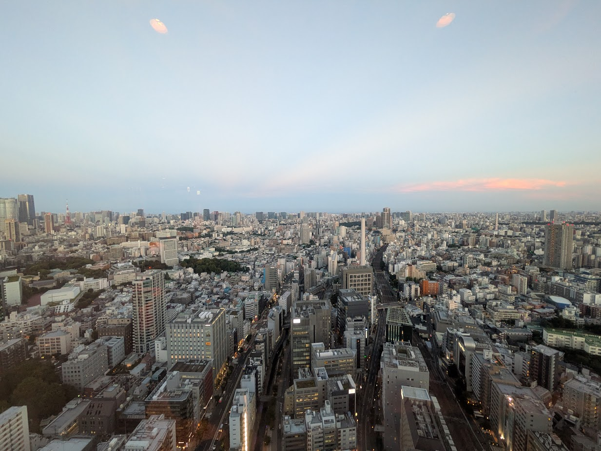
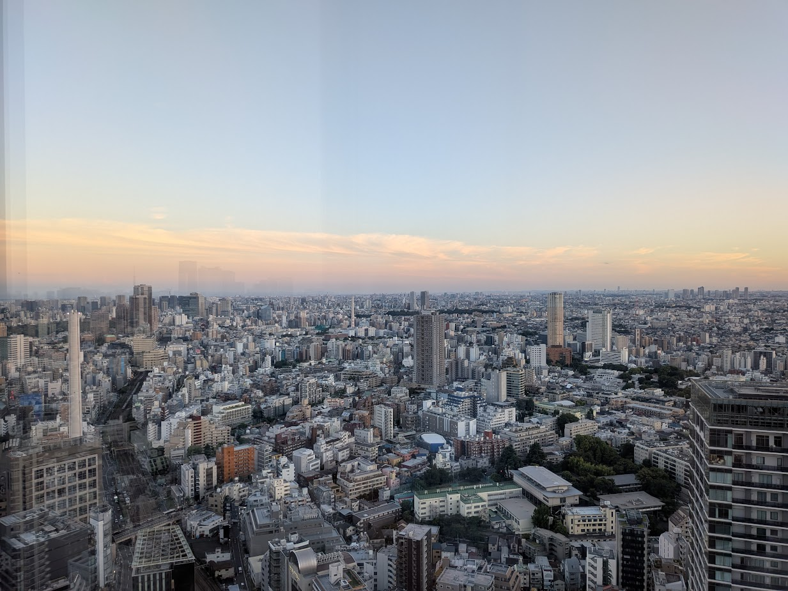